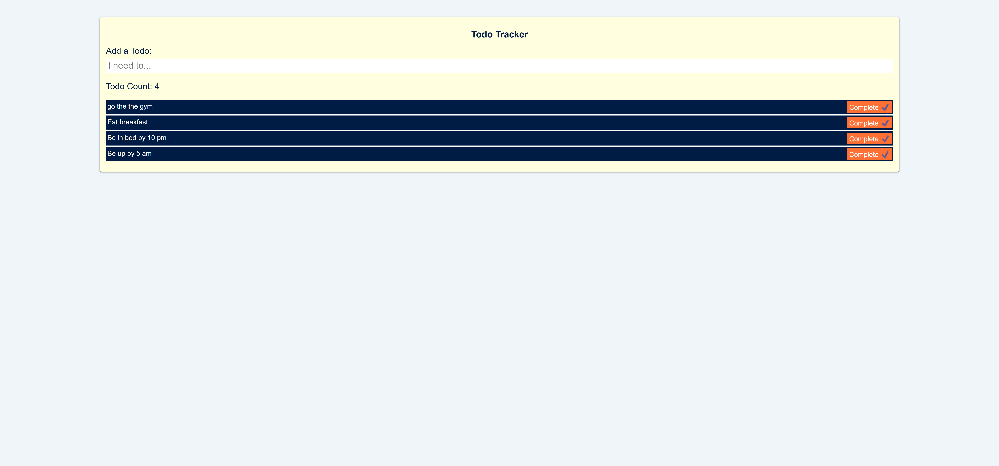

# Todo-List

## Description
In this project I am building a todos list app using HTML, CSS, and JavaScript (Local Storage). 

## User Story
- As I user I want to be able to create a multuple to do list with a complete check mark
- Once the to do list has been added, as I user I want to be able to remove that to do list 

## Acceptance Criteria 
- Its done when a user inspect the devTool and the current stored in a object
- Its done when the object is saved as a string and using localStorage 

## Link TO Deployed Page 
coming soon....
## Mock-Up 

